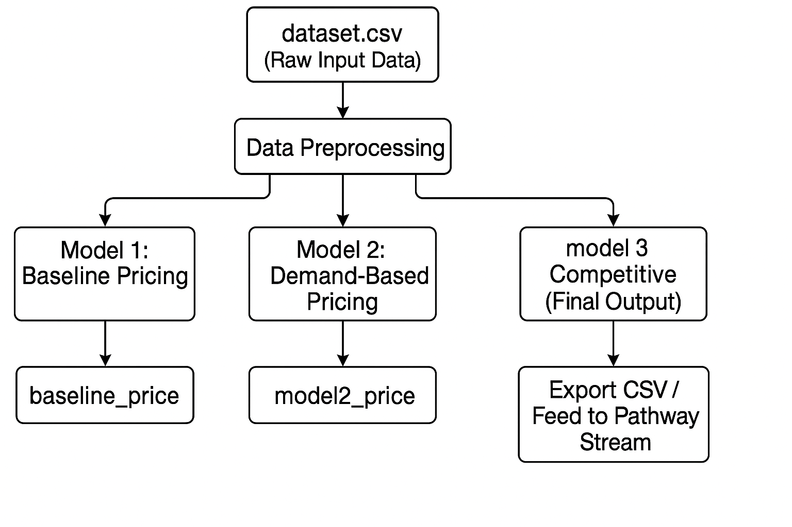

# 🚗 Dynamic Pricing for Urban Parking Lots

Capstone Project — **Summer Analytics 2025**  
Hosted by: **Consulting & Analytics Club × Pathway**

---

## 🔍 Project Overview

Urban parking is a limited and mismanaged resource. Static pricing leads to underutilized or overcrowded parking lots.  
This project simulates a **dynamic pricing engine** that adjusts prices based on:

- Occupancy patterns
- Queue length
- Traffic congestion nearby
- Special days/events
- Type of incoming vehicle
- Prices of nearby competitors

---

## 🛠️ Tech Stack

| Component         | Tool/Library         |
|------------------|----------------------|
| Programming Lang | Python 3             |
| Data Handling    | Pandas, NumPy        |
| Geo Calculations | Geopy                |
| Real-time Engine | Pathway (planned)    |
| Visualization    | Bokeh / Matplotlib   |
| IDE              | Google Colab         |

---

## 🧱 System Architecture

---

## 🧠 Workflow & Model Breakdown

### 🔹 Model 1: Baseline Linear Pricing

> A simple occupancy-based model  
> `price = prev_price + α × (occupancy / capacity)`

---

### 🔹 Model 2: Demand-Based Pricing

>`Demand is calculated using multiple weighted features:`
>`demand = α1*(occupancy/capacity) + α2queue - α3traffic + α4special_day + α5vehicle_type`
>`price = base_price × (1 + scaler × normalized_demand)`
---

### 🔹 Model 3: Competitive Pricing (Final Output)

- Calculates nearby parking lots within 0.5 km
- Adjusts current lot’s price based on neighbor prices:
  - If neighbors are cheaper → lower price
  - If neighbors are expensive → raise price

---

## 📈 Output Columns

| Column Name     | Description                          |
|-----------------|--------------------------------------|
| `baseline_price`| Model 1 price                        |
| `demand`        | Calculated demand score              |
| `model2_price`  | Model 2 dynamic price                |
| `model3_price`  | Final price after competitive logic  |

---

## ✅ Results Summary

- Prices dynamically reflect congestion, queues, and competitor behavior.
- System is modular and fast — optimized for large datasets (18k+ rows).
- Designed to plug into Pathway for real-time streaming next.

---

## 📌 Future Extensions

- ⏱️ Integrate Pathway real-time data ingestion
- 📊 Dashboards for lot managers
- 🤖 Add reinforcement learning for price optimization
- 🌍 Expand to city-wide deployment simulation

---

## 🤝 Contributor

- **Tushar Sangwan**  
  B.Tech, Computer Engineering  
  Thapar Institute of Engineering & Technology

---
